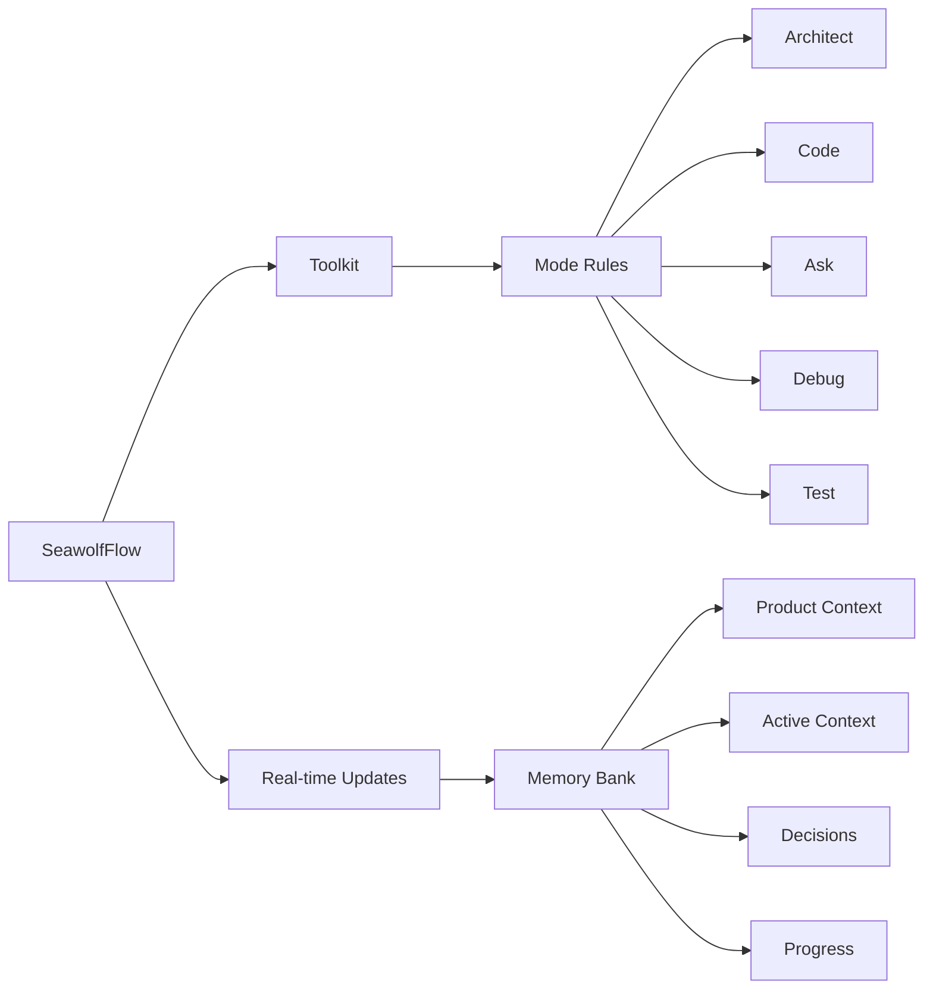

<div align="center">

### By popular demand, ✨MCP server tools✨ have been added!

<br>
  
### ☢️☢️☢️ Footgun in Use ☢️☢️☢️

<br>

# 🚀 SeawolfFlow 🌊

**Persistent Project Context and Streamlined AI-Assisted Development**

[](https://github.com/SeawolfVetGit/Seawolf-Code)
[](https://github.com/GreatScottyMac/SeawolfFlow)

</div>

## 🎯 Overview

SeawolfFlow enhances AI-assisted development in VS Code by providing **persistent project context** and **optimized mode interactions**, resulting in **reduced token consumption** and a more efficient workflow.  It builds upon the concepts of the Seawolf Code Memory Bank, but streamlines the process and introduces a more integrated system of modes. SeawolfFlow ensures your AI assistant maintains a deep understanding of your project across sessions, even after interruptions.

### Key Improvements over Seawolf Code Memory Bank:

*   **Reduced Token Consumption:** Optimized prompts and instructions minimize token usage.
*   **Five Integrated Modes:**  Architect, Code, Test, Debug, and Ask modes work together seamlessly.
*   **Simplified Setup:**  Easier installation and configuration.
*   **Streamlined Real-time Updates:**  More efficient and targeted Memory Bank updates.
*   **Clearer Instructions:**  Improved YAML-based rule files for better readability and maintainability.

### Key Components



- 🧠 **Memory Bank**: Persistent storage for project knowledge (automatically managed).
- 💻 **System Prompts**: YAML-based core instructions for each mode (`.Seawolf/system-prompt-[mode]`).
- 🔧 **VS Code Integration**: Seamless development experience within VS Code.
- ⚡ **Real-time Updates**:  Automatic Memory Bank updates triggered by significant events.

## 🚀 Quick Start

   ###  1. Installation

   1.  **Install Seawolf Code Extension:** Ensure you have the Seawolf Code extension installed in VS Code.
   2.  **Download [SeawolfFlow Files:](https://github.com/GreatScottyMac/SeawolfFlow/tree/main/config)** Download the following files from this repository:
   *   [`system-prompt-architect`](https://github.com/GreatScottyMac/SeawolfFlow/blob/main/config/.Seawolf/system-prompt-architect)
   *   [`system-prompt-ask`](https://github.com/GreatScottyMac/SeawolfFlow/blob/main/config/.Seawolf/system-prompt-ask)
   *   [`system-prompt-code`](https://github.com/GreatScottyMac/SeawolfFlow/blob/main/config/.Seawolf/system-prompt-code)
   *   [`system-prompt-debug`](https://github.com/GreatScottyMac/SeawolfFlow/blob/main/config/.Seawolf/system-prompt-debug) 
   *   [`system-prompt-test`](https://github.com/GreatScottyMac/SeawolfFlow/blob/main/config/system-prompt-test)
   *   [`.Seawolfmodes`](https://github.com/GreatScottyMac/SeawolfFlow/blob/main/config/.Seawolf/system-prompt-test)
   *   [`insert-variables.cmd`](https://github.com/GreatScottyMac/SeawolfFlow/blob/main/config/insert-variables.cmd)For Windows OS
   *   [`insert-variables.sh`](https://github.com/GreatScottyMac/SeawolfFlow/blob/main/config/insert-variables.sh)For Unix/Linux/macOS
   3.  **Place Files in Project:**
   *   Create a directory named `.Seawolf` in your project's Seawolft directory.
   *   Place the `system-prompt-[mode]` files inside the `.Seawolf` directory.
   * Place the `.Seawolfmodes` file in the project's Seawolft directory.
   * Place the appropriate `insert-variables.[sh/cmd]` script for your platform in the project's Seawolft directory.

   Your project structure should look like this:

   ```
   project-Seawolft
    ├── .Seawolf
    |    ├── system-prompt-architect
    |    ├── system-prompt-ask
    |    ├── system-prompt-code
    |    ├── system-prompt-debug
    |    └── system-prompt-test
    ├── memory-bank (This directory will be created automatically by Seawolf after your first prompt)
    |    ├── activeContext.md
    |    ├── decisionLog.md
    |    ├── productContext.md
    |    ├── progress.md
    |    └── systemPatterns.md               
    ├── .Seawolfmodes
    └──insert-variables.[sh/cmd]
```
   4. **Run insert-variables script**

   #### For Windows: 
   1. Open Command Prompt or PowerShell
   2. Navigate to your project:
      ```cmd
      cd path\to\your\project
      ```
   3. Run the script:

      From Command Prompt:

      ```cmd
      insert-variables.cmd
      ```

      From Powershell:

      ```powershell
      .\insert-variables.cmd
      ```
      Troubleshooting (Windows)
   * **If you get "access denied" or execution policy errors:**
   1. Open PowerShell as Administrator
   2. Run this command once:
      ```powershell
      Set-ExecutionPolicy RemoteSigned -Scope CurrentUser
      ```
   3. Close Administrator PowerShell
   4. Try running the script again from your project directory
   * **If you see "Error: .Seawolf directory not found", verify your directory structure.**
   * **If using PowerShell 7+, run as:**
      ```powershell
      cmd /c insert-variables.cmd
      ```
   #### For Unix/Linux/macOS
   1. Open Terminal
   2. Navigate to your project:
      ```bash
      cd path/to/your/project
      ```
   3. Make the script executable:
      ```bash
      chmod +x insert-variables.sh
      ```
   4. Run the script:
      ```bash
      ./insert-variables.sh
      ```

      Troubleshooting (Unix/Linux/macOS)
   * **If you see "Permission denied", run:** 
      ```bash
      chmod +x insert-variables.sh
      ```
   * **If you see "Error: .Seawolf directory not found", verify your directory structure**

    
   #### Expected Output
   The script will:
   1. Detect your system configuration
   2. Process each system prompt file
   3. Show "Processing" and "Completed" messages for each file
   4. Display "Done" when finished


   #### Variables Being Replaced
   The script replaces these placeholders with your system-specific values:
   - OS_PLACEHOLDER (e.g., "Windows 10 Pro" or "Ubuntu 22.04")
   - SHELL_PLACEHOLDER (e.g., "cmd" or "bash")
   - HOME_PLACEHOLDER (your home directory)
   - WORKSPACE_PLACEHOLDER (your project directory)
   - GLOBAL_SETTINGS_PLACEHOLDER (Seawolf Code global settings path)
   - MCP_LOCATION_PLACEHOLDER (Seawolf Code MCP directory path)
   - MCP_SETTINGS_PLACEHOLDER (Seawolf Code MCP settings path)

   #### Next Steps
   After running the script:
   1. Verify that `.Seawolf/system-prompt-*` files contain your system paths
   2. Start using VS Code with the Seawolf Code extension
   3. The Memory Bank will be initialized on first use

   ### 2. Using SeawolfFlow

   1.  **Start a Chat:** Open a new Seawolf Code chat in your project.
   2.  **Select a Mode:** Choose the appropriate mode (Architect, Code, Test, Debug, Ask) for your task.
   3.  **Interact with Seawolf:**  Give Seawolf instructions and ask questions. Seawolf will automatically use the Memory Bank to maintain context.
   4.  **Memory Bank Initialization:**  If you start a chat in a project *without* a `memory-bank/` directory, Seawolf will suggest switching to Architect mode and guide you through the initialization process.
   5. **"Update Memory Bank" Command:** At any time, you can type "Update Memory Bank" or "UMB" to force a synchronization of the chat session's information into the Memory Bank. This is useful for ensuring continuity across sessions or before switching modes.

## 📚 Memory Bank Structure

The Memory Bank is a directory named `memory-bank` located in your project's Seawolft. It contains several Markdown files that store different aspects of your project's knowledge:

| File                 | Purpose                                                                                                                               |
| -------------------- | ------------------------------------------------------------------------------------------------------------------------------------- |
| `activeContext.md`   | Tracks the current session's context: recent changes, current goals, and open questions/issues.                                       |
| `decisionLog.md`     | Records architectural and implementation decisions, including the context, decision, rationale, and implementation details.        |
| `productContext.md`  | Provides a high-level overview of the project, including its goals, features, and overall architecture.                             |
| `progress.md`        | Tracks the progress of the project, including completed work, current tasks, and next steps.  Uses a task list format.               |
| `systemPatterns.md` | (Optional) Documents recurring patterns and standards used in the project (coding patterns, architectural patterns, testing patterns). |

SeawolfFlow automatically manages these files. You generally don't need to edit them directly, although you can review them to understand the AI's knowledge.

## ✨ Features

### 🧠 Persistent Context

SeawolfFlow remembers project details across sessions, maintaining a consistent understanding of your codebase, design decisions, and progress.

### ⚡ Real-time Updates

The Memory Bank is updated automatically based on significant events within each mode, ensuring that the context is always up-to-date.

### 🤝 Mode Collaboration

The five modes (Architect, Code, Test, Debug, Ask) are designed to work together seamlessly.  They can switch between each other as needed, and they share information through the Memory Bank.

### ⬇️ Reduced Token Consumption

SeawolfFlow is designed to use fewer tokens than previous systems, making it more efficient and cost-effective.

## 📝 UMB Command
The command "Update Memory Bank" or "UMB" can be given at any time to update the memory bank with information from the current chat session.

## Contributing

Contributions to SeawolfFlow are welcome! Please see the [CONTRIBUTING.md](CONTRIBUTING.md) file (you'll need to create this) for guidelines.

## License
  [Apache 2.0](LICENSE)
